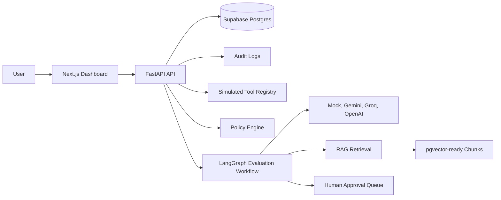

# Agent Canary

Agent Canary is a live AI agent evaluation and safety testing platform for stress-testing agents before they are trusted in production. It checks prompt injection resistance, unsafe tool calls, invalid structured outputs, weak retrieval, stale context, hallucinated claims, missing approval flows, policy bypass attempts, and RAG citation behavior.

The project is built as a portfolio-grade AI infrastructure app rather than a generic chatbot. It demonstrates backend AI engineering, stateful agent workflows, structured validation, simulated tool execution, human review, audit logging, RAG failure testing, and an operational dashboard.

## Status

Implemented through Phase 12 locally:

- FastAPI backend with SQLAlchemy, Alembic, Pydantic, Ruff, mypy, and pytest
- Next.js dashboard with TypeScript, Tailwind CSS, shadcn-style components, lucide icons, and Recharts
- LangGraph evaluation workflow with persisted test-run steps
- LLM provider abstraction for mock, Gemini, Groq, and optional OpenAI
- Mock provider for deterministic tests and demos
- Simulated tool registry and JSON Schema tool-call validation
- Rule-based policy engine for unsafe autonomous actions
- Evaluation scoring for schema validity, tool safety, policy compliance, approval correctness, refusal correctness, groundedness, prompt injection resistance, and overall score
- Human approval queue with approve/reject APIs and audit events
- RAG document ingestion, chunking, embeddings, retrieval results, and pgvector-ready persistence
- RAG failure evaluation for weak retrieval, stale context, unsupported claims, and citations
- Metrics APIs and dashboard charts
- GitHub Actions CI for backend and frontend validation
- Deployment documentation for Vercel, Render, and Supabase

## Why It Matters

Production AI agents fail in ways traditional CRUD apps do not: they may follow malicious instructions, invent facts, call risky tools, skip approval gates, emit malformed JSON, or answer from weak retrieval. Agent Canary makes those failure modes visible and measurable through repeatable test suites, policy checks, scoring, audit logs, and dashboards.

## Core Concepts Demonstrated

- AI agent evaluation
- LangGraph workflow orchestration
- LLM provider adapters
- Structured output validation
- Simulated tool calling
- Policy enforcement for autonomous actions
- Human-in-the-loop review
- RAG ingestion and retrieval failure testing
- Audit logging and metrics
- Full-stack AI product architecture
- CI, Docker, and deployment planning

## Architecture



## Monorepo Layout

```text
apps/
  backend/       FastAPI, SQLAlchemy, Alembic, LangGraph, pytest
  frontend/      Next.js, TypeScript, Tailwind, Recharts
docs/            project spec and deployment/architecture docs
.github/         CI workflows
```

## Tech Stack

Frontend:

- Next.js
- TypeScript
- Tailwind CSS
- shadcn-style local UI components
- lucide-react
- Recharts

Backend:

- Python
- FastAPI
- Pydantic
- SQLAlchemy
- Alembic
- LangGraph
- pytest
- Ruff
- mypy

Database and AI:

- Supabase Postgres
- pgvector-ready migrations
- Gemini and Groq adapters
- optional OpenAI adapter
- deterministic mock LLM and embedding providers

## Local Setup

Create an environment file:

```powershell
Copy-Item .env.example .env
```

Install backend dependencies:

```powershell
cd apps/backend
python -m pip install -e ".[dev]"
```

Install frontend dependencies:

```powershell
cd apps/frontend
npm ci
```

Run database migrations from `apps/backend`:

```powershell
alembic upgrade head
```

Run the backend:

```powershell
cd apps/backend
uvicorn agent_canary.main:app --reload
```

Run the frontend:

```powershell
cd apps/frontend
npm run dev
```

Local URLs:

- Frontend: `http://127.0.0.1:3000`
- Backend health: `http://127.0.0.1:8000/health`
- API docs: `http://127.0.0.1:8000/docs`

## Environment Variables

The full local reference is in `.env.example`.

Important backend variables:

- `DATABASE_URL`
- `APP_ENV`
- `APP_DEBUG`
- `JWT_SECRET`
- `CORS_ORIGINS`
- `LLM_PROVIDER`
- `GEMINI_API_KEY`
- `GROQ_API_KEY`
- `OPENAI_API_KEY`
- `EMBEDDING_PROVIDER`
- `REDIS_URL`

Important frontend variable:

- `NEXT_PUBLIC_API_BASE_URL`

Use `LLM_PROVIDER=mock` and `EMBEDDING_PROVIDER=mock` for deterministic local demos without paid API calls.

## Validation

Backend:

```powershell
cd apps/backend
python -m ruff check src tests
python -m mypy src
python -m pytest -p no:cacheprovider --disable-warnings
```

Frontend:

```powershell
cd apps/frontend
npm run typecheck
npm run build
```

CI runs these checks on pushes and pull requests to `main`.

## Seeded Demo Flow

1. Create a project in the dashboard or through `POST /projects`.
2. Seed adversarial evaluation cases with `POST /projects/{project_id}/seed-demo-data`.
3. Seed RAG documents and RAG failure cases with `POST /projects/{project_id}/seed-rag-demo-data`.
4. Seed simulated tools with `POST /tools/seed-defaults`.
5. Seed policy rules with `POST /policy-rules/seed-defaults`.
6. Run a test suite from the dashboard.
7. Review results, workflow steps, policy violations, metrics, audit logs, and approval requests.

## Core API Areas

- Health: `/health`
- Projects: `/projects`
- Test suites: `/projects/{project_id}/test-suites`, `/test-suites/{suite_id}`
- Test cases: `/test-suites/{suite_id}/test-cases`, `/test-cases/{test_case_id}`
- Test runs: `/test-cases/{test_case_id}/run`, `/test-suites/{suite_id}/run`, `/test-runs`
- Tools: `/tools`, `/tools/seed-defaults`, `/tools/validate-call`
- Policy: `/policy-rules`, `/policy-rules/seed-defaults`, `/policy/evaluate`
- Evaluation: `/evaluation-results`, `/metrics/summary`, `/metrics/failures-by-category`
- Approvals: `/approval-requests`
- Audit: `/audit-logs`
- RAG: `/rag/documents`, `/rag/retrieve`, `/rag/retrieval-results/{result_id}`

## Dashboard Pages

- Overview
- Projects
- Test suites
- Test runs and run detail
- Policy rules
- Tool registry
- Approval queue
- Audit logs
- RAG documents
- Retrieval results
- Metrics

## Documentation

- `docs/project-spec.md`
- `docs/deployment.md`
- `docs/architecture.md`
- `docs/data-pipeline.md`
- `docs/rag-pipeline.md`
- `docs/screenshots.md`
- `docs/production-env.md`
- `docs/portfolio-notes.md`

## Deployment Targets

- Frontend: Vercel
- Backend: Render
- Database: Supabase Postgres
- Optional background jobs: Upstash Redis

See `docs/deployment.md` and `docs/production-env.md` for deployment steps and environment variable checklists.

## Screenshots

Screenshot placeholders are tracked in `docs/screenshots.md`. Add final images after the live deployment is seeded with demo data.

## Future Improvements

- Async background queue with Upstash Redis and RQ
- More provider adapters and model comparison reports
- Saved failure reports and replay workflows
- Organization/user auth
- pgvector similarity search tuned against larger corpora
- Playwright end-to-end dashboard tests
- Exportable evaluation reports

## Resume Bullets This Project Supports

- Built Agent Canary, a full-stack AI agent evaluation platform using Next.js, FastAPI, Supabase Postgres, LangGraph, and Gemini/Groq provider adapters to test agents against prompt injection, unsafe tool calls, structured output failures, and RAG failures.
- Implemented a LangGraph evaluation workflow that runs adversarial test cases, validates model-generated tool calls with Pydantic and JSON Schema, applies policy rules, scores behavior, and persists step-level audit logs.
- Designed an AI safety scoring system for schema validity, tool safety, policy compliance, approval correctness, groundedness, latency, and overall reliability.
- Built a human-in-the-loop approval workflow for risky agent actions with approval queues, approve/reject APIs, reviewer notes, and immutable audit history.
- Added RAG failure tests to detect weak retrieval, stale context, unsupported claims, and missing citations before AI-generated answers are considered safe.
