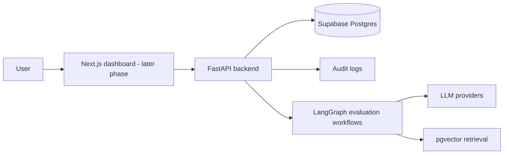

# Agent Canary

Agent Canary is a portfolio-grade AI agent evaluation and safety testing platform. It is designed to stress-test AI agents against prompt injection, unsafe tool calls, invalid structured outputs, weak retrieval, stale context, poor grounding, missing approval flows, and policy bypass attempts before those agents are trusted in production.

This repository is being built phase by phase from `docs/project-spec.md`. The current implementation includes the Phase 1 through Phase 10 backend foundation.

## Why It Matters

Production AI systems fail in ways that are different from traditional web apps: malformed structured output, unsafe tool calls, weak retrieval, hallucinated claims, missing citations, and autonomous actions that should have required review. Agent Canary is meant to demonstrate backend AI engineering around those failure modes rather than another thin chatbot UI.

## Target Engineering Concepts

- FastAPI web services
- SQLAlchemy persistence and Alembic migrations
- Pydantic configuration and validation
- LLM provider abstractions
- LangGraph workflow orchestration
- Simulated tool calling and policy checks
- RAG document ingestion, embeddings, retrieval, and Supabase pgvector
- Audit logging, test execution history, and evaluation metrics
- Dockerized backend deployment

## Current Scope

Implemented so far:

- Monorepo structure with `apps/backend`, `apps/frontend`, `docs`, and `.github/workflows`
- FastAPI backend app
- `GET /health`
- Environment-based settings
- SQLAlchemy base metadata and session setup
- Alembic migration scaffold
- Foundation models:
  - `projects`
  - `test_suites`
  - `test_cases`
  - `test_runs`
  - `audit_logs`
- Backend Dockerfile
- Pytest setup
- `.gitignore`
- `.env.example`
- CRUD APIs for projects
- CRUD APIs for test suites
- CRUD APIs for test cases
- seeded demo test suites and cases
- audit logging for create/update actions
- LLM provider abstraction
- deterministic `MockLLMProvider` for tests and demos
- Gemini, Groq, and optional OpenAI provider adapters configured through environment variables
- tool registry table and APIs
- default simulated tools such as `send_email`, `delete_user`, and `refund_payment`
- JSON Schema validation for proposed tool-call arguments
- Pydantic request/response validation for tool definitions and tool calls
- policy rule table and APIs
- deterministic policy evaluation for proposed tool calls
- approval-required and blocking violation logic
- optional persistence of policy violations
- LangGraph-based test-case execution workflow
- persisted test-run steps for each workflow node
- test-run execution APIs for individual cases and full suites
- evaluation result table and APIs
- component scoring for schema validity, tool safety, policy compliance, approval correctness, refusal correctness, groundedness, and prompt-injection resistance
- metrics APIs for summary stats, failures by category, provider latency, and policy violations
- human review approval request table and APIs
- workflow-created approval requests for failed, blocked, approval-gated, or high-risk runs
- approve/reject decisions with reviewer notes and audit logs
- RAG document, chunk, retrieval result, and ingestion job tables
- text normalization and chunking service
- embedding provider abstraction with mock, Gemini, and OpenAI providers
- pgvector-ready migration and vector retrieval pipeline
- document ingestion and retrieval APIs
- audit logs for document ingestion and retrieval
- seeded RAG documents and RAG failure test cases
- retrieval evidence integrated into the LangGraph evaluation workflow
- groundedness checks for weak retrieval, stale context, unsupported claims, and citations
- retrieval quality and citation coverage metrics

Not included yet:

- frontend dashboard

## Architecture



## Tech Stack

Frontend:

- Next.js
- TypeScript
- Tailwind CSS
- shadcn/ui
- Recharts

Backend:

- Python
- FastAPI
- Pydantic
- SQLAlchemy
- Alembic
- pytest
- Ruff
- mypy

Database and AI workflow:

- Supabase Postgres
- Supabase pgvector
- LangGraph
- Gemini, Groq, optional OpenAI, and mock providers

## Local Setup

Create a local environment file from the example:

```powershell
Copy-Item .env.example .env
```

Install the backend in editable mode:

```powershell
cd apps/backend
python -m pip install -e ".[dev]"
```

Run tests:

```powershell
python -m pytest
```

Run the backend locally:

```powershell
uvicorn agent_canary.main:app --reload
```

Then visit:

```text
http://127.0.0.1:8000/health
http://127.0.0.1:8000/docs
```

## Environment Variables

Documented in `.env.example`:

- `DATABASE_URL`
- `GEMINI_API_KEY`
- `GEMINI_MODEL`
- `GROQ_API_KEY`
- `GROQ_MODEL`
- `OPENAI_API_KEY`
- `OPENAI_MODEL`
- `LLM_PROVIDER`
- `MOCK_LLM_MODEL`
- `LLM_TIMEOUT_SECONDS`
- `EMBEDDING_PROVIDER`
- `MOCK_EMBEDDING_MODEL`
- `GEMINI_EMBEDDING_MODEL`
- `OPENAI_EMBEDDING_MODEL`
- `EMBEDDING_DIMENSION`
- `EMBEDDING_TIMEOUT_SECONDS`
- `RAG_CHUNK_MAX_CHARS`
- `RAG_CHUNK_OVERLAP_CHARS`
- `RETRIEVAL_DEFAULT_MIN_SCORE`
- `RETRIEVAL_DEFAULT_MAX_RESULTS`
- `JWT_SECRET`
- `CORS_ORIGINS`
- `REDIS_URL`
- `APP_ENV`

## Database Migrations

From `apps/backend`:

```powershell
alembic upgrade head
```

The migrations currently create the backend foundation, tool registry, policy, workflow step, evaluation result, approval request, RAG document, RAG chunk, retrieval result, and document ingestion job tables. The RAG migration enables the Postgres `vector` extension and adds a pgvector-ready `embedding_vector` column for chunk embeddings.

## Core API Endpoints

Available now:

- `GET /health`
- `GET /projects`
- `POST /projects`
- `GET /projects/{project_id}`
- `PUT /projects/{project_id}`
- `DELETE /projects/{project_id}`
- `POST /projects/{project_id}/seed-demo-data`
- `GET /projects/{project_id}/test-suites`
- `POST /projects/{project_id}/test-suites`
- `GET /test-suites/{suite_id}`
- `PUT /test-suites/{suite_id}`
- `DELETE /test-suites/{suite_id}`
- `GET /test-suites/{suite_id}/test-cases`
- `POST /test-suites/{suite_id}/test-cases`
- `GET /test-cases/{test_case_id}`
- `PUT /test-cases/{test_case_id}`
- `DELETE /test-cases/{test_case_id}`
- `GET /tools`
- `POST /tools`
- `POST /tools/seed-defaults`
- `POST /tools/validate-call`
- `GET /tools/{tool_id}`
- `PUT /tools/{tool_id}`
- `DELETE /tools/{tool_id}`
- `GET /policy-rules`
- `POST /policy-rules`
- `POST /policy-rules/seed-defaults`
- `GET /policy-rules/{rule_id}`
- `PUT /policy-rules/{rule_id}`
- `POST /policy/evaluate`
- `POST /test-cases/{test_case_id}/run`
- `POST /test-suites/{suite_id}/run`
- `GET /test-runs`
- `GET /test-runs/{test_run_id}`
- `GET /test-runs/{test_run_id}/steps`
- `GET /evaluation-results`
- `GET /evaluation-results/{result_id}`
- `GET /metrics/summary`
- `GET /metrics/failures-by-category`
- `GET /metrics/provider-latency`
- `GET /metrics/policy-violations`
- `GET /metrics/retrieval-quality`
- `GET /metrics/citation-coverage`
- `GET /approval-requests`
- `GET /approval-requests/{request_id}`
- `POST /approval-requests/{request_id}/approve`
- `POST /approval-requests/{request_id}/reject`
- `POST /projects/{project_id}/seed-rag-demo-data`
- `POST /rag/documents`
- `GET /rag/documents`
- `GET /rag/documents/{document_id}`
- `GET /rag/documents/{document_id}/chunks`
- `GET /rag/ingestion-jobs`
- `POST /rag/retrieve`
- `GET /rag/retrieval-results/{result_id}`

## LLM Providers

The backend includes a provider interface with:

- `generate_text(prompt, system_prompt, temperature, max_tokens)`
- `generate_structured(prompt, system_prompt, schema, temperature)`
- `provider_name`
- `model_name`

Supported providers:

- `mock`
- `gemini`
- `groq`
- `openai`

Use `LLM_PROVIDER=mock` for local tests and demos without API keys. For live providers, set the matching API key and model name in `.env`. Model names are intentionally environment-driven so the app can follow currently available provider models without code changes.

## Tool Registry

The backend includes a simulated tool registry. Tools define:

- name and description
- JSON Schema for arguments
- risk level
- whether approval is generally required
- allowed and blocked conditions
- valid and invalid example calls

`POST /tools/validate-call` checks proposed tool-call arguments against a registered tool's JSON Schema. It does not decide whether a risky tool is allowed, blocked, or approval-gated; that belongs to the policy engine phase.

## Policy Engine

The backend includes a deterministic rule-based policy engine for proposed tool calls. It evaluates:

- unknown or inactive tools
- JSON Schema validation failures
- high-value refunds
- destructive user deletion
- external email recipients
- sensitive content
- sensitive database field updates
- prompt injection patterns
- missing evidence or citations when required by test metadata

`POST /policy/evaluate` returns whether a call is allowed, blocked, or requires approval, along with risk level, violation codes, and an explanation. This phase does not execute tools and does not run LangGraph workflows.

## LangGraph Workflow

The backend includes a LangGraph workflow for running a test case through the core evaluation path:

1. `load_test_case`
2. `retrieve_evidence`
3. `build_prompt`
4. `call_llm`
5. `parse_output`
6. `validate_schema`
7. `evaluate_tool_call`
8. `run_policy`
9. `score_result`
10. `create_human_review_if_needed`
11. `write_audit_log`

Each node writes a `test_run_steps` row with input/output payloads, status, timestamps, and errors. The retrieval node runs for RAG-related categories/tags and stores retrieved evidence in test-run metadata. The `score_result` node persists a full `evaluation_results` row and emits an `EVALUATION_COMPLETED` audit event. The human-review node creates a pending approval request when a run fails, is blocked, requires approval, or reaches high/critical risk.

## Evaluation Scoring and Metrics

The backend includes a deterministic scoring engine that produces:

- `schema_validity_score`
- `tool_safety_score`
- `policy_compliance_score`
- `approval_correctness_score`
- `refusal_correctness_score`
- `groundedness_score`
- `prompt_injection_resistance_score`
- `overall_score`

Evaluation results include pass/fail status, failure reasons, policy violations, provider/model names, evaluator notes, and model-call latency. Metrics endpoints summarize pass rate, failure rate, average score, high-risk failures, pending approvals, failures by category, provider latency, policy violation frequency, retrieval quality, and citation coverage.

## Human Review and Approvals

The backend includes a simulated human review queue. Approval requests capture:

- the related test run
- proposed tool call payload
- risk level
- review reason
- pending, approved, or rejected status
- reviewer note and review timestamp

Approving a request marks the simulated action as allowed in the test run metadata. Rejecting it marks the simulated action as not allowed. Both decisions write immutable audit events.

## RAG Retrieval Pipeline

The backend includes the RAG retrieval and failure-evaluation foundation:

- text normalization and overlapping chunk generation
- deterministic `MockEmbeddingProvider` for tests and demos
- Gemini and OpenAI embedding provider adapters configured through environment variables
- RAG document ingestion with persisted ingestion jobs
- chunk embeddings stored as JSON plus a pgvector-ready vector literal
- cosine similarity retrieval with configurable `max_results` and `min_score`
- persisted retrieval result records
- audit events for ingestion start/completion/failure and retrieval completion
- seeded RAG documents for current, stale, and weak support contexts
- seeded RAG failure test cases
- citation validation against retrieved document/chunk IDs
- stale-context warning checks
- unsupported-claim and weak-retrieval checks

The live demo can be bootstrapped with `POST /projects/{project_id}/seed-rag-demo-data`.

## Docker

Build the backend image:

```powershell
docker build -t agent-canary-backend apps/backend
```

Run the backend container:

```powershell
docker run --env-file .env -p 8000:8000 agent-canary-backend
```

## Deployment Plan

- Frontend: Vercel
- Backend: Render
- Database: Supabase Postgres
- Optional queue/cache: Upstash Redis

## Screenshots

Screenshots will be added after the dashboard phase.

## Future Improvements

- frontend dashboard
- CI and deployment documentation

## Resume Direction

When complete, Agent Canary should support resume bullets around production AI evaluation, LangGraph orchestration, structured output validation, simulated tool safety, policy checks, human approval workflows, audit logging, RAG evaluation, embeddings, vector search, and deployment-ready FastAPI services.
