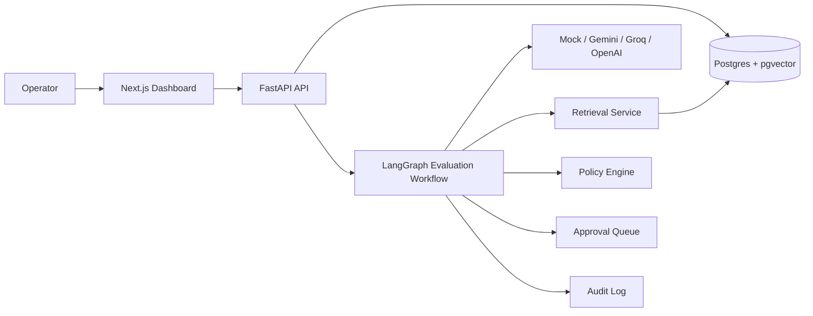

# Agent Canary

**A safety testing platform for AI agents.** Before an agent is trusted to call real tools or answer real customers, Agent Canary runs it through repeatable adversarial test suites and scores how it behaves. It catches prompt injection, unsafe tool calls, malformed JSON, weak retrieval, hallucination, missing approval flows, and policy bypass — and surfaces every decision in an operational dashboard with full audit history.

Agent Canary does not execute real tools. Agents produce structured proposed actions; the platform validates the JSON, checks the tool schema, applies a policy engine, scores ten safety dimensions, and creates human-review requests when needed.

## Why It Exists

Production AI agents fail in ways traditional CRUD apps do not. They follow malicious instructions, invent facts, propose risky tool calls, skip approval gates, emit malformed JSON, or answer confidently from weak retrieval. These failures rarely show up in unit tests and they are easy to miss in casual chat sessions. Agent Canary makes them visible and measurable — repeatable test cases, deterministic scoring, persisted evidence, dashboards.

## What It Does

- **Runs adversarial test suites** against any agent through a pluggable LLM provider layer.
- **Validates structured outputs** against a Pydantic + JSON Schema contract.
- **Validates proposed tool calls** against per-tool argument schemas in a registry of simulated tools.
- **Applies a policy engine** with rules for prompt injection, sensitive content, approval thresholds, citation integrity, weak retrieval, stale context, and unsupported claims.
- **Scores ten safety dimensions** per run: schema validity, tool safety, policy compliance, approval correctness, refusal correctness, groundedness, prompt injection resistance, retrieval quality, citation coverage, and latency.
- **Routes high-risk actions** to a human approval queue with approve/reject APIs and reviewer notes.
- **Tests RAG behaviour** with weak retrieval, stale context, unsupported claims, and missing-citation cases — backed by document ingestion, chunking, embeddings, and pgvector cosine retrieval.
- **Persists everything**: test runs, every workflow step, every LLM call, every proposed tool call, every retrieval, every policy violation, every audit event.
- **Visualizes safety posture**: pass/fail trend, score over time, failure categories, policy violations, approval outcomes, retrieval quality, citation coverage, provider latency.

## Architecture



A single test run flows through 11 LangGraph nodes: load case → retrieve evidence → build prompt → call LLM → parse → validate schema → validate tool call → run policy → score → create review (if risky) → persist + audit.

## Tech Stack

**Frontend:** Next.js, TypeScript, Tailwind CSS, Recharts, lucide-react, Vitest.
**Backend:** FastAPI, Pydantic, SQLAlchemy 2, Alembic, LangGraph, jsonschema, httpx.
**Database:** Postgres with pgvector for vector similarity.
**AI providers:** Pluggable interface with adapters for Gemini, Groq, optional OpenAI, plus a deterministic mock for tests and free demos.
**Tooling:** Ruff, mypy (strict), pytest, GitHub Actions, Docker, docker-compose.

## Local Setup

The fastest path uses Docker:

```powershell
docker compose up --build
```

This starts a pgvector-enabled Postgres and the FastAPI backend on `http://127.0.0.1:8000`. Run the frontend separately:

```powershell
cd apps/frontend
npm ci
npm run dev
```

The dashboard is then on `http://127.0.0.1:3000`.

To run the backend natively instead of via Docker:

```powershell
Copy-Item .env.example .env
cd apps/backend
python -m pip install -e ".[dev]"
alembic upgrade head
uvicorn agent_canary.main:app --reload
```

The default `.env.example` uses `LLM_PROVIDER=mock` and `EMBEDDING_PROVIDER=mock` so no paid API keys are required for a complete local demo. Switch to Gemini, Groq, or OpenAI by setting the corresponding key and model name.

## Trying It Out

Once the backend is running, seed a demo project:

```bash
curl -X POST http://127.0.0.1:8000/projects \
  -H "Content-Type: application/json" \
  -d '{"name":"Demo"}'
# returns: {"id": "<project-id>", ...}

curl -X POST http://127.0.0.1:8000/tools/seed-defaults
curl -X POST http://127.0.0.1:8000/policy-rules/seed-defaults
curl -X POST http://127.0.0.1:8000/projects/<project-id>/seed-demo-data
curl -X POST http://127.0.0.1:8000/projects/<project-id>/seed-rag-demo-data
```

That gives you nine simulated tools, thirteen policy rules, six adversarial test suites with twenty-five cases, and the RAG document corpus. Open the dashboard, pick a suite, click **Run**, and watch the metrics fill in.

Interactive API docs live at `http://127.0.0.1:8000/docs`.

## Project Layout

```text
apps/
  backend/   FastAPI service, LangGraph workflow, Alembic migrations, pytest
  frontend/  Next.js dashboard, Vitest tests
docs/        Architecture, API reference, safety model, evaluation design
```

## Documentation

- [`docs/architecture.md`](docs/architecture.md) — system diagram, service boundaries, deployment shape
- [`docs/ai-safety-model.md`](docs/ai-safety-model.md) — threat model, defense layers, risk lattice
- [`docs/evaluation-design.md`](docs/evaluation-design.md) — the ten component scores and how to add new ones
- [`docs/rag-pipeline.md`](docs/rag-pipeline.md) — ingestion, chunking, embeddings, retrieval
- [`docs/api.md`](docs/api.md) — every REST endpoint with request/response shapes
- [`docs/deployment.md`](docs/deployment.md) — Vercel + Render + Supabase guide

## Running The Tests

Backend:

```powershell
cd apps/backend
python -m ruff check src tests
python -m mypy src
python -m pytest
```

Frontend:

```powershell
cd apps/frontend
npm run typecheck
npm test
npm run build
```

GitHub Actions runs the full matrix on every push and pull request to `main`.

## License

This is a portfolio project authored by Gaurav Singh. No commercial license is offered.
