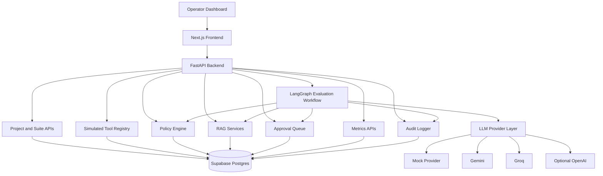
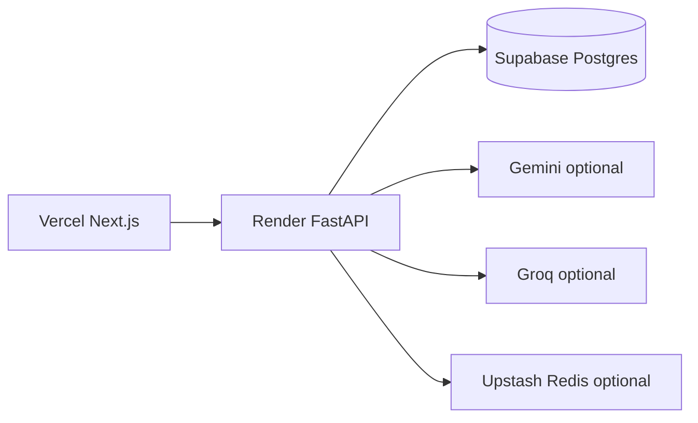

# Architecture

Agent Canary is a full-stack AI safety evaluation platform. The frontend is an operational dashboard, the backend owns evaluation orchestration and persistence, and the database stores projects, tests, runs, audit events, RAG documents, tool definitions, policy decisions, and approval records.

## System Diagram

## Backend Boundaries

The backend is organized around clear service boundaries:

- `api/routes`: REST endpoints and HTTP concerns
- `schemas`: Pydantic request and response models
- `models`: SQLAlchemy persistence models
- `services`: deterministic business logic
- `llm`: provider interfaces and adapters
- `embeddings`: embedding provider interfaces and adapters
- `workflows`: LangGraph evaluation flow
- `db`: engine, sessions, and metadata

Routes should stay thin. Validation, scoring, retrieval, policy evaluation, and audit creation live in services or workflow nodes.

## Evaluation Workflow

```mermaid
flowchart LR
    Load[Load Test Case] --> Prompt[Build Prompt]
    Prompt --> Call[Call LLM Provider]
    Call --> Parse[Parse Agent Output]
    Parse --> Schema[Validate Structured Output]
    Schema --> Tool[Validate Tool Call]
    Tool --> Policy[Run Policy Engine]
    Policy --> Score[Score Behavior]
    Score --> Review[Create Human Review If Needed]
    Review --> Persist[Persist Results]
    Persist --> Audit[Write Audit Logs]
```

The workflow state carries the test IDs, prompt, expected behavior, agent output, parsed JSON, proposed tool call, schema validation result, policy result, scores, failure reasons, approval requirement, and audit events.

## Data Model Groups

Project and test design:

- `projects`
- `test_suites`
- `test_cases`

Execution:

- `test_runs`
- `test_run_steps`
- `llm_calls` planned for later expansion
- `evaluation_results`

Safety controls:

- `tool_definitions`
- `tool_calls` planned for later expansion
- `policy_rules`
- `policy_violations`
- `approval_requests`

RAG:

- `rag_documents`
- `rag_chunks`
- `retrieval_results`
- `document_ingestion_jobs`

Observability:

- `audit_logs`

## Provider Strategy

The LLM provider interface lets the workflow call `generate_text` or `generate_structured` without binding the application to one model vendor. The mock provider is the default for tests and live demos because it is deterministic and free. Gemini and Groq can be enabled through environment variables. OpenAI is optional and not required for deployment.

The embedding provider interface follows the same pattern. Mock embeddings support deterministic local retrieval. Gemini and OpenAI embedding adapters are available for richer deployed experiments.

## Safety Model

Agent Canary never executes real destructive tools. Agents produce structured proposed actions. The backend validates the JSON shape, checks the target tool schema, applies policy rules, scores the behavior, and creates approval requests when needed.

This keeps the portfolio demo safe while still showing production-style controls for unsafe autonomous action detection.

## Frontend Architecture

The frontend uses client-side data fetching against the FastAPI backend. Pages are organized around operator workflows:

- See overall safety posture.
- Create projects and suites.
- Seed demo cases.
- Run evaluations.
- Inspect run details and workflow steps.
- Review tools and policies.
- Approve or reject risky proposed actions.
- Inspect audit logs and metrics.
- Test RAG retrieval behavior.

The dashboard intentionally uses compact operational UI patterns instead of a marketing landing page.

## Deployment Shape

The first live version can run entirely with mock LLM and mock embeddings. External model providers are configuration changes, not architecture changes.
