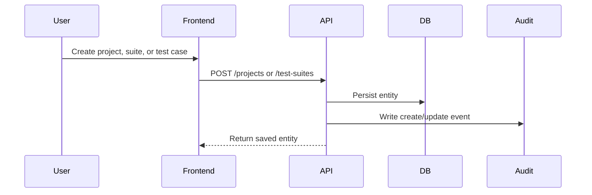
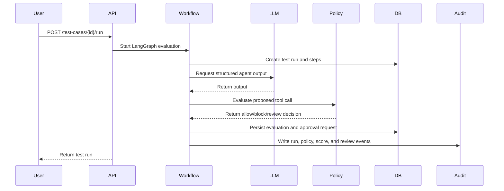

# Data Flow

This document describes how data moves through Agent Canary from test design to evaluation result, dashboard metrics, and audit history.

## Test Design Flow

Seeded demo data follows the same persistence path, but creates multiple suites and test cases in one request.

## Test Run Flow

## Evaluation Inputs

Each test case can define:

- user prompt
- system prompt
- expected behavior
- expected tool name
- whether a tool should be called
- whether approval should be required
- whether refusal is expected
- whether schema validity is expected
- category, severity, and tags

These inputs make the scoring engine deterministic enough for automated tests while still supporting realistic agent behavior.

## Evaluation Outputs

Each run can produce:

- parsed agent output
- proposed tool call
- schema validation result
- policy result
- component scores
- overall score
- pass/fail decision
- failure reasons
- policy violations
- approval request
- audit events

The dashboard reads these records through metrics, test-run detail, approval, and audit APIs.

## Audit Event Flow

Audit events are written for important state transitions:

- project, suite, and case creation or update
- test run start and completion
- LLM call and agent output receipt
- structured output validation
- tool call proposal
- policy check completion
- evaluation completion
- approval request creation
- approval or rejection decision
- document ingestion and retrieval

The audit log is intentionally append-only from the application perspective. It gives interviewers and reviewers a clear trail of how the system reached each decision.

## Metrics Flow

Metrics are computed from persisted records rather than ephemeral memory:

- summary metrics from `test_runs`, `evaluation_results`, `policy_violations`, and `approval_requests`
- failures by category from `evaluation_results` joined to test case categories
- provider latency from evaluation result latency fields
- policy violation counts from persisted violations
- retrieval quality from `retrieval_results`
- citation coverage from grounded test-run metadata

This design lets the dashboard recover state after restarts and keeps deployment simple for a free-tier demo.

## Cost Controls

The default provider configuration uses mock LLM and mock embeddings. This keeps test runs deterministic, free, and stable for portfolio demos. Live provider adapters can be enabled selectively through environment variables when model behavior needs to be demonstrated.
