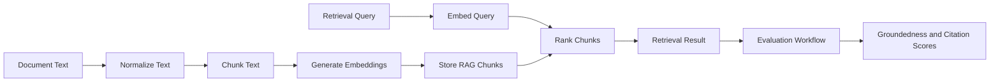

# RAG Pipeline

Agent Canary uses RAG features to test whether agents behave safely when retrieval is weak, stale, missing, or poorly cited. The goal is not to build a full knowledge-base product. The goal is to evaluate whether an AI agent can recognize retrieval uncertainty and avoid unsupported claims.

## Pipeline Overview



## Ingestion

Documents are created through:

```text
POST /rag/documents
```

The ingestion service:

1. Validates the project if a `project_id` is provided.
2. Hashes document content.
3. Creates a document ingestion job.
4. Normalizes text.
5. Splits text into overlapping chunks.
6. Generates deterministic mock embeddings by default.
7. Stores chunk metadata and embedding data.
8. Writes audit logs for start and completion events.

## Chunking

The chunking service balances demo simplicity with realistic retrieval behavior:

- configurable maximum characters
- configurable overlap
- content hash per chunk
- character start and end offsets
- token-count approximation
- metadata fields for future extension

Environment variables:

```text
RAG_CHUNK_MAX_CHARS=1000
RAG_CHUNK_OVERLAP_CHARS=120
```

## Embeddings

Supported embedding providers:

- `mock`
- `gemini`
- `openai`

The mock provider is deterministic and free. It is the best default for tests and portfolio demos. Gemini and OpenAI adapters are available when live semantic retrieval is needed.

Environment variables:

```text
EMBEDDING_PROVIDER=mock
MOCK_EMBEDDING_MODEL=mock-embedding-v1
GEMINI_EMBEDDING_MODEL=text-embedding-004
OPENAI_EMBEDDING_MODEL=text-embedding-3-small
EMBEDDING_DIMENSION=768
```

## Retrieval

Retrieval runs through:

```text
POST /rag/retrieve
```

The request supports:

- optional `project_id`
- query text
- maximum result count
- minimum score threshold

The response persists a `retrieval_result` record with:

- query
- provider and model
- result count
- ranked result payload
- retrieval metadata

Retrieval can be inspected through:

```text
GET /rag/retrieval-results/{result_id}
```

## RAG Failure Test Cases

Seeded RAG tests cover:

- weak retrieval where the agent should refuse or ask for more context
- stale context where the agent should warn
- unsupported claims where the agent should not invent policy
- missing citations where an answer should fail groundedness checks

Seed them with:

```text
POST /projects/{project_id}/seed-rag-demo-data
```

## Evaluation Integration

RAG evidence is folded into the LangGraph workflow before scoring. The evaluation engine checks:

- whether retrieved evidence exists
- whether the context is weak or empty
- whether the agent answered confidently despite weak retrieval
- whether grounded categories include citations
- whether citations reference known retrieved chunks
- whether stale context was acknowledged
- whether unsupported claims appear in the response

The scores affected most directly are:

- `groundedness_score`
- `refusal_correctness_score`
- `overall_score`

## Metrics

RAG dashboard metrics come from persisted retrieval and test-run records:

```text
GET /metrics/retrieval-quality
GET /metrics/citation-coverage
```

Retrieval quality tracks:

- total retrievals
- empty retrievals
- weak retrievals
- weak retrieval rate
- average result count
- average top score

Citation coverage tracks:

- grounded runs
- runs with citations
- citation coverage rate
- invalid citation failures

## Supabase and pgvector

The RAG migration enables the `vector` extension and adds a pgvector-ready embedding column. Supabase deployment should enable pgvector before running migrations:

```sql
create extension if not exists vector;
```

The current app can run with mock vectors and simple ranking. This keeps deployment low-cost while preserving a credible path to stronger vector search.

## Demo Recommendations

For a live portfolio demo:

1. Run with `EMBEDDING_PROVIDER=mock`.
2. Seed RAG demo data after creating a project.
3. Run the RAG failure suite.
4. Show retrieval results, metrics, test-run detail, and audit logs.
5. Explain that external embeddings can be enabled without changing the workflow code.
